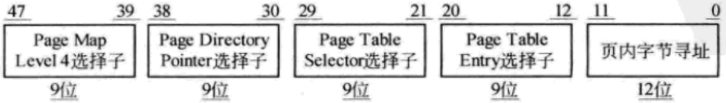

# **lec6 SPOC思考题**


**NOTICE**
- **有"w3l2"标记的题是助教要提交到学堂在线上的。**
- **有"w3l2"和"spoc"标记的题是要求拿清华学分的同学要在实体课上完成，并按时提交到学生对应的git repo上。**
- **有"hard"标记的题有一定难度，鼓励实现。**
- **有"easy"标记的题很容易实现，鼓励实现。**
- **有"midd"标记的题是一般水平，鼓励实现。**

## **与视频相关思考题**

### **6.1	非连续内存分配的需求背景**
    1. **为什么要设计非连续内存分配机制？**
     - 因为连续内存分配有许多缺点：
       - 会产生内存碎片，造成空间资源浪费
       - 难以面对程序动态分配内存的需求，使得内存利用率低
     - 非连续内存分配机制试图使得：
       - 提高内存利用率
       - 内存管理更加灵活
       - 充分利用和共享空间
    2. **非连续内存分配中内存分块大小有哪些可能的选择？大小与大小是否可变?**
     - 段和页
     - 段更大，页更小
     - 段大小可变，页大小固定

  3. **为什么在大块时要设计大小可变，而在小块时要设计成固定大小？小块时的固定大小可以提供多种选择吗？**
   - 大块可变可以使得内存分配更加灵活，小块固定更容易实现以及更加快速
   - 小块固定大小由系统对于页的支持确定

### **6.2	段式存储管理**
  1. **什么是段、段基址和段内偏移？**

     - 段表示访问方式、存储管理等属性相同的一块内存地址
     - 段基址是段内存地址的起始地址
     - 段内偏移是内存相对于段基址的偏移
  2. **段式存储管理机制的地址转换流程是什么？为什么在段式存储管理中，各段的存储位置可以不连续？这种做法有什么好处和麻烦？**
     - 转换流程
       - 先取出段号，去查进程的段表，找到对应的段大小和段基址
       - 检查段内偏移是否不大于段大小，否则抛出异常
       - 段内偏移+段基址得到程序在段中位置
     - 因为段基址保存在段表中，OS可以通过段号查询段表得到对应段地址，因此段号到段地址可以多一个映射关系，不一定要连续
     - 麻烦
       - 多一个层级，多访存一次，因此会慢一点。
     - 好处
       - 存储位置不需要连续，使用更加灵活
       - 多一层检查机制，起到一定的保护作用

### **6.3	页式存储管理**

 1. **什么是页（page）、帧（frame）、页表（page table）、存储管理单元（MMU）、快表（TLB, Translation Lookaside Buffer）和高速缓存（cache）？**

    - 页：逻辑地址空间的一块连续的地址
    - 帧：物理地址空间的一块连续的地址
    - 页表：储存进程中页与帧的虚实对应关系
    - 存储管理单元：处理逻辑地址与物理地址对应关系的硬件
    - 快表：相当于页表的cache
    - 高速缓存：此硬件利用局部性将部分内存存储起来，以便更快速地访问，对软件透明。
 1. **页式存储管理机制的地址转换流程是什么？为什么在页式存储管理中，各页的存储位置可以不连续？这种做法有什么好处和麻烦？**
    - 流程
      - 页号通过页表找到帧号
      - 用帧号+页内偏移（=帧内偏移）计算出最终的物理地址
    - 不连续
      - 同样，因为多了一层查表
    - 好处与麻烦应该同“段”

### **6.4	页表概述**

 1. **每个页表项有些什么内容？有哪些标志位？它们起什么作用？**
    - 页表项：包括标志位，帧号
    - 标志位（还有更多）
      - 存在位
        - 表明这个页表项不和一个帧对应，也就是无效
      - 引用位
        - 记录在过去一段时间是否被使用过
      - dirty位
        - 表示是否被修改过
 1. **页表大小受哪些因素影响？**
    - 帧号位数
    - 页号位数

### **6.5	快表和多级页表**

 1. **快表（TLB）与高速缓存（cache）有什么不同？**

    - TLB相当于对于页表项的高速缓存，而cache是对于内存而言的
    - TLB对于软件不透明，需要操作系统管理；而cache透明
 1. **为什么快表中查找物理地址的速度非常快？它是如何实现的？为什么它的的容量很小？**
    - 由特殊硬件实现，就像cache可以做得很快，但是成本很高
 1. **什么是多级页表？多级页表中的地址转换流程是什么？多级页表有什么好处和麻烦？**
    - 多级页表通过多层引用将页号分成多级，得到帧地址需要进行多次查找
    - 好处
      - 节省页表所占用的空间
    - 麻烦
      - 多次访问内存，更慢


### **6.6	反置页表**
 1. **页寄存器机制的地址转换流程是什么？**
    - 逻辑地址HASH，用来找快表
    - 快表冲突那么则遍历所有冲突链
    - 查不到则抛出异常
 1. **反置页表机制的地址转换流程是什么？**
    - 通过PID和页号进行hash
    - 查找索引表
    - 索引表的值直接访问反转页表
    - 若冲突，继续访问next
 1. **反置页表项有些什么内容？**
    - PID
    - VPN(页号)
    - NEXT（若冲突，下一个位置）

### **6.7	段页式存储管理**
 1. **段页式存储管理机制的地址转换流程是什么？这种做法有什么好处和麻烦？**

    - 流程
      - 段号查询段表得到段基址
      - 段基址+页号查页表得到帧基址
      - 帧基址+偏移量得到最终的物理地址
    - 好处
      - 段可以实现内存共享和保护
      - 页可以方便内存分配
    - 麻烦
      - 复杂，慢
 1. **如何实现基于段式存储管理的内存共享？**
    - 多个进程的段表相同，则这几个进程共享该段
    - 或者多个段表指向相同的物理地址
 1. **如何实现基于页式存储管理的内存共享？**
    - 多个进程的页表相同，则这几个进程共享该页
    - 或者多个页表项指向相同的帧

## **个人思考题**

**（1） (w3l2) 请简要分析64bit CPU体系结构下的分页机制是如何实现的**

x64体系中实现了48位的虚拟地址，通过4级页表实现寻址

页大小为4K，也即页偏移占12位

每个页表的页号占9位，如下图：




## **小组思考题**

**（1）(spoc) 某系统使用请求分页存储管理，若页在内存中，满足一个内存请求需要150ns (10^-9s)。若缺页率是10%，为使有效访问时间达到0.5us(10^-6s),求不在内存的页面的平均访问时间。请给出计算步骤。**

0.9\*150\*10^(-9)+0.1\* x =0.5\* 10^(-6)

**（2）(spoc) 有一台假想的计算机，页大小（page size）为32 Bytes，支持32KB的虚拟地址空间（virtual address space）,有4KB的物理内存空间（physical memory），采用二级页表，一个页目录项（page directory entry ，PDE）大小为1 Byte,一个页表项（page-table entries**
**PTEs）大小为1 Byte，1个页目录表大小为32 Bytes，1个页表大小为32 Bytes。页目录基址寄存器（page directory base register，PDBR）保存了页目录表的物理地址（按页对齐）。**

**PTE格式（8 bit） :**

```
  VALID | PFN6 ... PFN0
```
**PDE格式（8 bit） :**

```
  VALID | PT6 ... PT0
```
**其**
```
VALID==1表示，表示映射存在；VALID==0表示，表示映射不存在。
PFN6..0:页帧号
PT6..0:页表的物理基址>>5
```
**在[物理内存模拟数据文件](./03-2-spoc-testdata.md)中，给出了4KB物理内存空间的值，请回答下列虚地址是否有合法对应的物理内存，请给出对应的pde index, pde contents, pte index, pte contents。**
```
1) Virtual Address 6c74
   Virtual Address 6b22
2) Virtual Address 03df
   Virtual Address 69dc
3) Virtual Address 317a
   Virtual Address 4546
4) Virtual Address 2c03
   Virtual Address 7fd7
5) Virtual Address 390e
   Virtual Address 748b
```

**比如答案可以如下表示： (注意：下面的结果是错的，你需要关注的是如何表示)**
```
Virtual Address 7570:
  --> pde index:0x1d  pde contents:(valid 1, pfn 0x33)
    --> pte index:0xb  pte contents:(valid 0, pfn 0x7f)
      --> Fault (page table entry not valid)

Virtual Address 21e1:
  --> pde index:0x8  pde contents:(valid 0, pfn 0x7f)
      --> Fault (page directory entry not valid)

Virtual Address 7268:
  --> pde index:0x1c  pde contents:(valid 1, pfn 0x5e)
    --> pte index:0x13  pte contents:(valid 1, pfn 0x65)
      --> Translates to Physical Address 0xca8 --> Value: 16
```

**[链接](https://piazza.com/class/i5j09fnsl7k5x0?cid=664)有上面链接的参考答案。请比较你的结果与参考答案是否一致。如果不一致，请说明原因。**

**（3）请基于你对原理课二级页表的理解，并参考Lab2建页表的过程，设计一个应用程序（可基于python、ruby、C、C++、LISP、JavaScript等）可模拟实现(2)题中描述的抽象OS，可正确完成二级页表转换。**

**[链接](https://piazza.com/class/i5j09fnsl7k5x0?cid=664)有上面链接的参考答案。请比较你的结果与参考答案是否一致。如果不一致，提交你的实现，并说明区别。**

**（4）假设你有一台支持[反置页表](http://en.wikipedia.org/wiki/Page_table#Inverted_page_table)的机器，请问你如何设计操作系统支持这种类型计算机？请给出设计方案。**

 **(5)[X86的页面结构](http://os.cs.tsinghua.edu.cn/oscourse/OS2019spring/lecture06)**
---

## **扩展思考题**

**阅读64bit IBM Powerpc CPU架构是如何实现[反置页表](http://en.wikipedia.org/wiki/Page_table#Inverted_page_table)，给出分析报告。**


## **interactive　understand VM**

**[Virtual Memory with 256 Bytes of RAM](http://blog.robertelder.org/virtual-memory-with-256-bytes-of-ram/)：这是一个只有256字节内存的一个极小计算机系统。按作者的[特征描述](https://github.com/RobertElderSoftware/recc#what-can-this-project-do)，它具备如下的功能。**
 - **CPU的实现代码不多于500行；**
 - **支持14条指令、进程切换、虚拟存储和中断；**
 - **用C实现了一个小的操作系统微内核可以在这个CPU上正常运行；**
 - **实现了一个ANSI C89编译器，可生成在该CPU上运行代码；**
 - **该编译器支持链接功能；**
 - **用C89, Python, Java, Javascript这4种语言实现了该CPU的模拟器；**
 - **支持交叉编译；**
 - **所有这些只依赖标准C库。**

**针对op-cpu的特征描述，请同学们通过代码阅读和执行对自己有兴趣的部分进行分析，给出你的分析结果和评价。**

